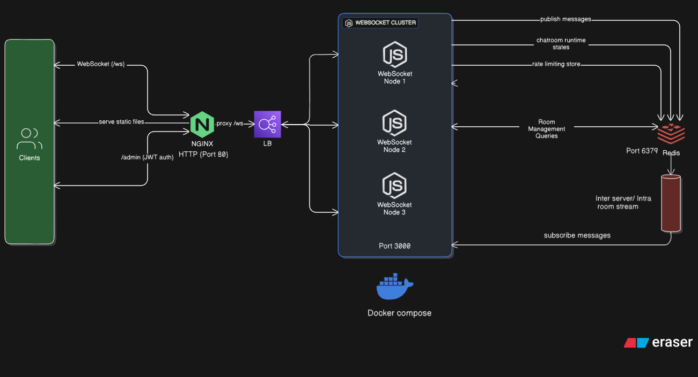

# Real-Time Chatroom Application

  A scalable, production-ready chatroom system built with WebSockets, Redis, and Docker. 
  Supports real-time messaging, room management, and admin controls with horizontal scaling capabilities.

  
  
  
  

---

## Table of Contents

- [Features](#features)
- [What are WebSockets?](#what-are-websockets)
- [Project Structure](#project-structure)
- [Quick Start](#quick-start)
- [Technology Stack](#technology-stack)
- [API Documentation](#api-documentation)
- [Development](#development)
- [Key Features](#key-features)
- [Contributing](#contributing)
- [License](#license)

---

## Features

### Core Functionality

<ul>
  <li><strong>Real-time messaging</strong> using WebSocket connections</li>
  <li><strong>Room-based chat system</strong> - create and join multiple chatrooms</li>
  <li><strong>Dynamic username updates</strong> with live notifications to all room members</li>
  <li><strong>Automatic cleanup system</strong> - removes inactive clients and empty rooms</li>
  <li><strong>Heartbeat monitoring</strong> - detects and removes dead connections</li>
  <li><strong>Admin panel</strong> with JWT authentication for comprehensive room/client management</li>
</ul>

### Scalability & Performance

<ul>
  <li><strong>Horizontal scaling</strong> with Redis pub/sub for inter-container communication</li>
  <li><strong>Load balancing</strong> via Nginx reverse proxy across multiple backend containers</li>
  <li><strong>Stateless backend</strong> architecture with centralized Redis state management</li>
  <li><strong>Docker containerization</strong> with multi-stage builds for optimized deployment</li>
  <li><strong>Redis auto-reconnect</strong> with ping monitoring for high availability</li>
  <li><strong>Monorepo structure</strong> with shared TypeScript types for better code organization</li>
</ul>

---

## What are WebSockets?

<blockquote>
  
WebSockets provide <strong>full-duplex communication</strong> between client and server over a single TCP connection. Unlike traditional HTTP requests:

</blockquote>

<ul>
  <li><strong>Persistent connection</strong> - eliminates the need to reconnect for each message</li>
  <li><strong>Real-time bidirectional</strong> - both client and server can send data at any time</li>
  <li><strong>Low latency</strong> - ideal for chat applications, gaming, and live updates</li>
  <li><strong>Efficient protocol</strong> - minimal overhead compared to HTTP polling methods</li>
</ul>

---

## Project Structure

<strong>Click to view complete project structure</strong>

<pre><code>chatroom-app/
├── backend/                          # Node.js + TypeScript backend
│   ├── admin/                        # Admin panel controllers and utilities
│   │   ├── admin.controller.ts       # Admin REST API endpoints
│   │   ├── admin.util.ts             # Admin helper functions
│   │   └── jwt.util.ts               # JWT token management
│   ├── redis/                        # Redis integration layer
│   │   ├── admin/                    
│   │   │   └── redis.admin.ts        # Redis admin operations
│   │   ├── redis.client.ts           # Redis client wrapper
│   │   ├── redis.helper.ts           # Redis utility functions
│   │   └── redis.util.ts             # Redis connection management
│   ├── service/                      
│   │   └── chatroom.service.ts       # Core chatroom business logic
│   ├── util/                         
│   │   └── chatroom.util.ts          # Chatroom helper functions
│   ├── chatroom.websocket.ts         # WebSocket server implementation
│   ├── Dockerfile                    # Standard Docker build
│   ├── Dockerfile.es-build           # Optimized ESBuild Docker image
│   ├── index.ts                      # Application entry point
│   ├── tsconfig.json                 # TypeScript configuration
│   └── types.ts                      # Backend type definitions
├── frontend/                         # Static frontend with Nginx
│   ├── public/                       
│   │   ├── assets/                   
│   │   │   └── backgroundpic.jpg     # UI assets
│   │   ├── src/                      # Frontend TypeScript modules
│   │   │   ├── app.ts                # Main application logic
│   │   │   ├── dom.client.ts         # DOM manipulation
│   │   │   ├── socket.client.ts      # WebSocket client
│   │   │   ├── state.ts              # Frontend state management
│   │   │   └── types.client.ts       # Frontend type definitions
│   │   ├── style/                    
│   │   │   └── style.css             # Compiled Tailwind CSS
│   │   └── index.html                # Main HTML template
│   ├── Dockerfile                    # Nginx + static assets
│   └── nginx.conf                    # Nginx configuration
├── shared/                           # Shared TypeScript definitions
│   ├── const.ts                      # Application constants
│   ├── message.type.ts               # Message type definitions
│   └── request.enum.ts               # Request type enums
├── docker-compose.yml                # Multi-container orchestration
├── package.json                      # Node.js dependencies
├── tsconfig.json                     # Root TypeScript config
└── README.md                         # This file
</code></pre>

---

## Quick Start

### Prerequisites

<ul>
  <li><strong>Docker</strong> and <strong>Docker Compose</strong> installed</li>
  <li><strong>Node.js 18+</strong> (for local development)</li>
</ul>

### Using Docker Compose (Recommended)

<ol>
  <li><strong>Clone the repository</strong>
    <pre><code>git clone &lt;repository-url&gt;
cd chatroom-app</code></pre>
  </li>
  
  <li><strong>Set environment variables</strong>
    <pre><code># Create .env file or export directly
export ADMIN_USER=admin
export ADMIN_PASS=your_secure_password
export JWT_SECRET=your_jwt_secret_key</code></pre>
  </li>
  
  <li><strong>Start all services</strong>
    <pre><code>docker compose up --build</code></pre>
  </li>
  
  <li><strong>Access the application</strong>
    <ul>
      <li>Main app: <a href="http://localhost:80">http://localhost:80</a></li>
      <li>Admin panel: <a href="http://localhost:80/admin">http://localhost:80/admin</a></li>
    </ul>
  </li>
</ol>

### Manual Setup

<ol>
  <li><strong>Start Redis</strong>
    <pre><code>docker run -d -p 6379:6379 redis:7-alpine</code></pre>
  </li>
  
  <li><strong>Install dependencies</strong>
    <pre><code>npm install</code></pre>
  </li>
  
  <li><strong>Start backend</strong>
    <pre><code>npm run dev</code></pre>
  </li>
  
  <li><strong>Build frontend assets</strong>
    <pre><code>cd frontend
npx tailwindcss -i ./input.css -o ./public/style.css --watch</code></pre>
  </li>
</ol>

---

## Technology Stack

### Backend
<ul>
  <li><code>Node.js + TypeScript</code> - Core server runtime and type safety</li>
  <li><code>WebSocket (ws)</code> - Real-time bidirectional communication</li>
  <li><code>Express</code> - HTTP routing and middleware</li>
  <li><code>Redis</code> - Pub/sub messaging and distributed state management</li>
  <li><code>JWT</code> - Secure admin authentication</li>
</ul>

### Frontend
<ul>
  <li><code>Vanilla JavaScript</code> - DOM manipulation and event handling</li>
  <li><code>TypeScript</code> - Type-safe client-side development</li>
  <li><code>Tailwind CSS</code> - Utility-first styling framework</li>
  <li><code>Custom State Management</code> - Event-driven UI updates</li>
</ul>

### Infrastructure
<ul>
  <li><code>Docker</code> - Multi-stage container builds</li>
  <li><code>Nginx</code> - Reverse proxy and load balancing</li>
  <li><code>Redis</code> - Auto-reconnect and health monitoring</li>
  <li><code>ESBuild</code> - Fast TypeScript compilation and bundling</li>
</ul>

---

## API Documentation

### WebSocket Request Types

<pre><code>export enum RequestType {
  CREATE = "create",    // Create new chatroom
  JOIN = "join",        // Join existing room
  MESSAGE = "message",  // Send message to room
  RENAME = "rename",    // Update username
  CONNECT = "connect",  // Initial connection
  LEAVE = "leave",      // Leave current room
  NOTIFY = "notify",    // System notifications
}</code></pre>

### WebSocket Message Examples

<strong>Client to Server Messages</strong>

<pre><code>// Create a new chatroom
{
  "type": "CREATE",
  "payload": { 
    "roomName": "General Chat" 
  }
}

// Join existing room
{
  "type": "JOIN", 
  "payload": { 
    "roomId": "room_123" 
  }
}

// Send message to current room
{
  "type": "MESSAGE",
  "payload": { 
    "content": "Hello World!" 
  }
}

// Update username
{
  "type": "RENAME",
  "payload": { 
    "username": "NewUsername" 
  }
}

// Leave current room
{
  "type": "LEAVE",
  "payload": {}
}</code></pre>

### Admin REST API

#### Authentication

<pre><code>POST /admin/login
Content-Type: application/json

{
  "username": "admin",
  "password": "password"
}

Response:
{
  "token": "eyJhbGciOiJIUzI1NiIsInR5cCI6IkpXVCJ9..."
}</code></pre>

#### Management Endpoints

<blockquote>
  
<strong>Note:</strong> All management endpoints require <code>Authorization: Bearer &lt;token&gt;</code> header

</blockquote>

<table>
  <thead>
    <tr>
      <th>Method</th>
      <th>Endpoint</th>
      <th>Description</th>
    </tr>
  </thead>
  <tbody>
    <tr>
      <td><code>GET</code></td>
      <td><code>/admin/servers</code></td>
      <td>Server statistics and container information</td>
    </tr>
    <tr>
      <td><code>GET</code></td>
      <td><code>/admin/clients</code></td>
      <td>Array of all connected client IDs</td>
    </tr>
    <tr>
      <td><code>GET</code></td>
      <td><code>/admin/rooms</code></td>
      <td>Array of all active room IDs</td>
    </tr>
    <tr>
      <td><code>GET</code></td>
      <td><code>/admin/room/:id</code></td>
      <td>Detailed room metadata for specific room</td>
    </tr>
    <tr>
      <td><code>GET</code></td>
      <td><code>/admin/client/:id</code></td>
      <td>Client metadata for specific client</td>
    </tr>
    <tr>
      <td><code>DELETE</code></td>
      <td><code>/admin/room/:id</code></td>
      <td>Delete room and remove all clients</td>
    </tr>
    <tr>
      <td><code>DELETE</code></td>
      <td><code>/admin/client/:id</code></td>
      <td>Remove client and exit from all rooms</td>
    </tr>
  </tbody>
</table>

#### Health Check

<pre><code>GET /health

Response:
{
  "uptime": 352.11,
  "message": "OK", 
  "timestamp": 1724200000000
}</code></pre>

---

## Development

### Local Development Setup

<ol>
  <li><strong>Clone and install</strong>
    <pre><code>git clone &lt;repository-url&gt;
cd chatroom-app
npm install</code></pre>
  </li>
  
  <li><strong>Start Redis</strong>
    <pre><code>docker run -d -p 6379:6379 redis:7-alpine</code></pre>
  </li>
  
  <li><strong>Set environment variables</strong>
    <pre><code>export ADMIN_USER=admin
export ADMIN_PASS=dev_password
export JWT_SECRET=dev_secret_key</code></pre>
  </li>
  
  <li><strong>Start development server</strong>
    <pre><code>npm run dev</code></pre>
  </li>
</ol>

### Building Docker Images

<pre><code># Backend with ESBuild optimization
docker build -f backend/Dockerfile.es-build -t chatrooms-backend:latest .

# Frontend with Nginx
docker build -f frontend/Dockerfile -t chatrooms-frontend:latest .

# Build all services
docker compose build</code></pre>

### Development Scripts

<ul>
  <li><code>npm run dev</code> - Start development server with hot reload</li>
  <li><code>npm run build</code> - Build TypeScript to JavaScript</li>
  <li><code>npm run start</code> - Start production server</li>
  <li><code>npm run lint</code> - Run ESLint code analysis</li>
  <li><code>npm run format</code> - Format code with Prettier</li>
</ul>

---

## Key Features

### Auto-Cleanup System

<ul>
  <li><strong>Client disconnection</strong> → automatically removed from all rooms</li>
  <li><strong>Empty rooms</strong> → deleted when last user leaves</li>
  <li><strong>Heartbeat monitoring</strong> → removes unresponsive connections</li>
  <li><strong>Redis ping monitoring</strong> → ensures connection reliability</li>
  <li><strong>Memory leak prevention</strong> → guaranteed cleanup on all edge cases</li>
</ul>

### Horizontal Scaling

<ul>
  <li><strong>Stateless backends</strong> → any container can handle any request</li>
  <li><strong>Redis pub/sub</strong> → messages broadcast across all containers</li>
  <li><strong>Load balancing</strong> → Nginx distributes WebSocket connections</li>
  <li><strong>Health checks</strong> → containers start only when dependencies are ready</li>
  <li><strong>Auto-reconnect Redis</strong> → handles network failures gracefully</li>
</ul>

### Production Ready

<ul>
  <li><strong>Multi-stage Docker builds</strong> → optimized image sizes</li>
  <li><strong>ESBuild optimization</strong> → faster builds and smaller bundles</li>
  <li><strong>Nginx configuration</strong> → WebSocket proxy with proper headers</li>
  <li><strong>Rate limiting</strong> → prevents message flooding</li>
  <li><strong>Error handling</strong> → graceful degradation and recovery</li>
  <li><strong>Monorepo structure</strong> → shared types and better organization</li>
</ul>

---

## Contributing

<ol>
  <li>Fork the repository</li>
  <li>Create a feature branch: <code>git checkout -b feature/amazing-feature</code></li>
  <li>Make your changes</li>
  <li>Add tests if applicable</li>
  <li>Commit your changes: <code>git commit -m 'Add amazing feature'</code></li>
  <li>Push to the branch: <code>git push origin feature/amazing-feature</code></li>
  <li>Submit a pull request</li>
</ol>

### Development Guidelines

<ul>
  <li>Follow the existing code style and formatting</li>
  <li>Write meaningful commit messages</li>
  <li>Update documentation for new features</li>
  <li>Ensure all tests pass before submitting PR</li>
  <li>Keep PRs focused on a single feature or bug fix</li>
</ul>

---

## License

This project is licensed under the MIT License - see the <a href="LICENSE">LICENSE</a> file for details.

---

  <strong>Built with ❤️ for real-time communication</strong> 
  <em>⭐ Star this repo if you found it helpful!</em>

